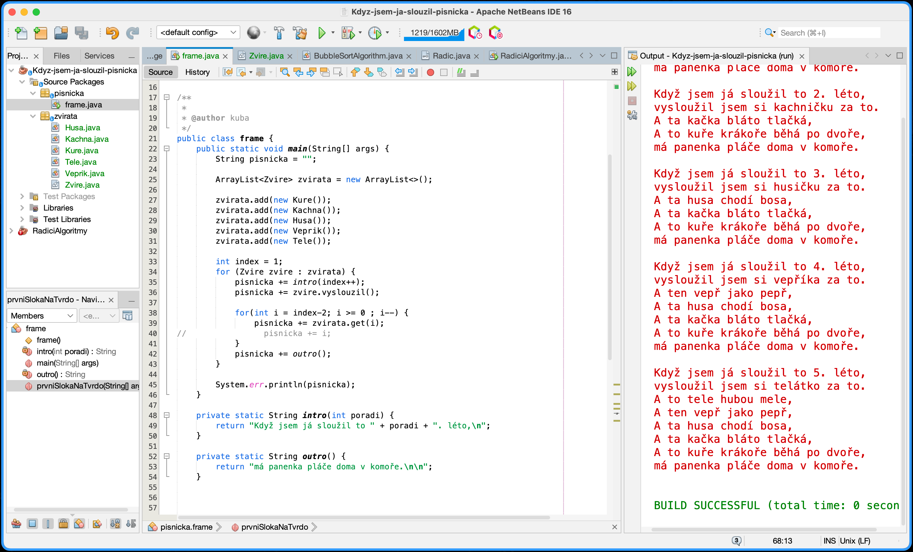

# Když jsem já sloužil - písnicka

# Zadání
https://www.promaminky.cz/pisnicky/lidove-36/kdyz-jsem-ja-slouzil-287



## Výstup

```text
Když jsem já sloužil to 1. léto,
vysloužil jsem si kuřátko za to.
A to kuře krákoře běhá po dvoře,
má panenka pláče doma v komoře.

Když jsem já sloužil to 2. léto,
vysloužil jsem si kachničku za to.
A ta kačka bláto tlačká,
A to kuře krákoře běhá po dvoře,
má panenka pláče doma v komoře.

Když jsem já sloužil to 3. léto,
vysloužil jsem si husičku za to.
A ta husa chodí bosa,
A ta kačka bláto tlačká,
A to kuře krákoře běhá po dvoře,
má panenka pláče doma v komoře.

Když jsem já sloužil to 4. léto,
vysloužil jsem si vepříka za to.
A ten vepř jako pepř,
A ta husa chodí bosa,
A ta kačka bláto tlačká,
A to kuře krákoře běhá po dvoře,
má panenka pláče doma v komoře.

Když jsem já sloužil to 5. léto,
vysloužil jsem si telátko za to.
A to tele hubou mele,
A ten vepř jako pepř,
A ta husa chodí bosa,
A ta kačka bláto tlačká,
A to kuře krákoře běhá po dvoře,
má panenka pláče doma v komoře.
```