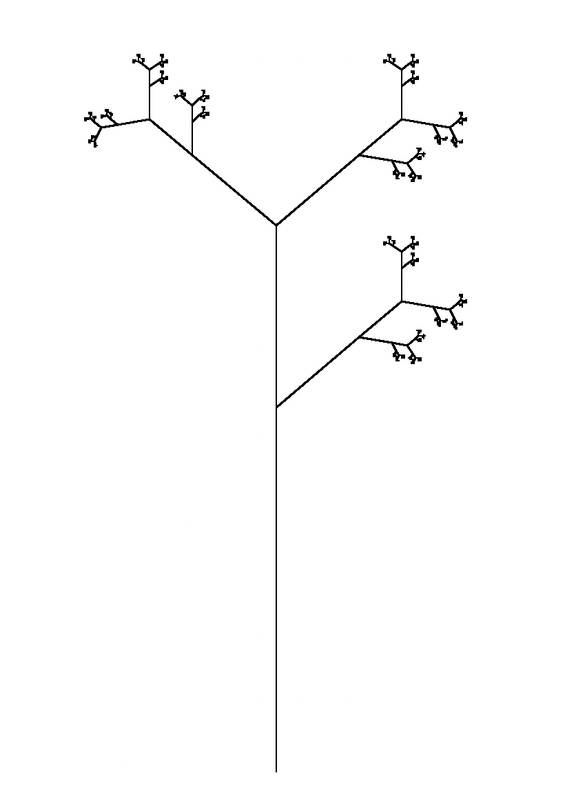
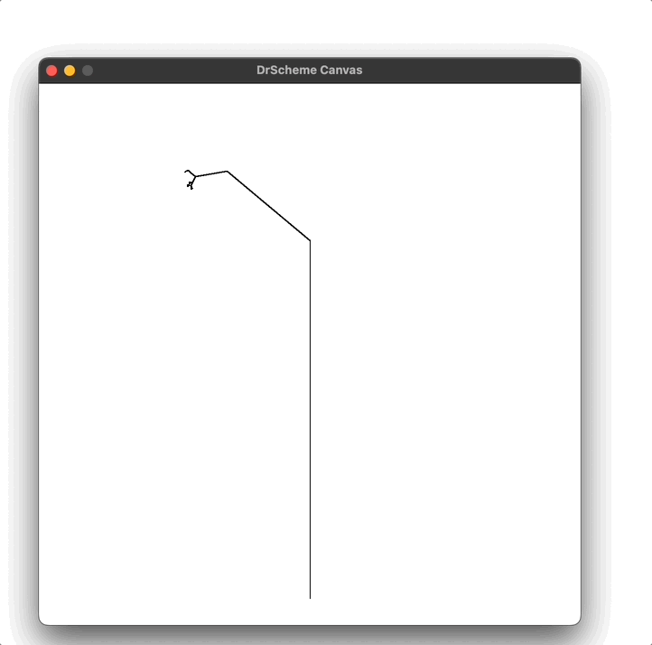

# Racket Intro

## ÚKOL 6 - Fraktály

V tomto úkolu se budeme zabývat fraktály. Fraktál je matematický objekt, který je
vlastně jenom zobecněním geometrického tvaru. Fraktály se využívají v mnoha
oblastech, například v umění, informatice, matematice, nebo je také můžeme nalézt v přírodě.

